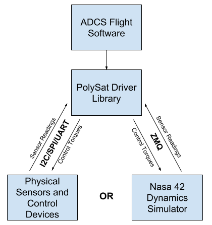
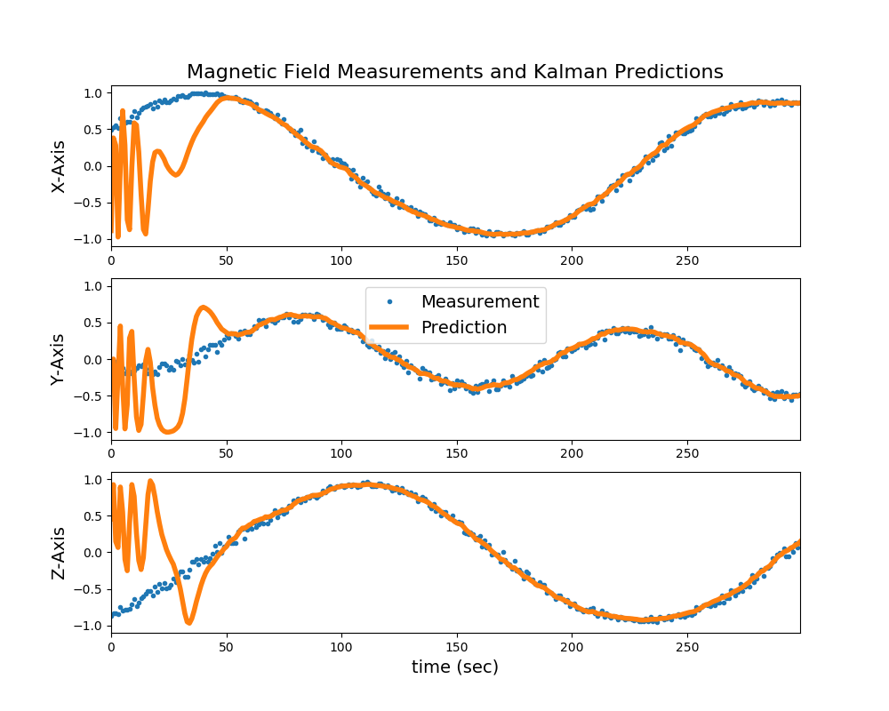

# Spacecraft Attitude Determination and Control (ADCS)

`youtube: nKMPYCKfi-g`

An animation depicting convergence of the determination algorithm in a simulation. The attitude estimate was initialized to be incorrect with high angular rates. The attitude estimate converges to the true orientation in about 50 seconds.

For my physics senior project, I worked on attitude determination and control software for PolySat satellites. This control software utilized magnetometers, solar angle sensors, magnetorquers, and reaction wheels to do determination and control. The determination algorithm employed a Kalman filter to improve accuracy. This work built off work done by several aerospace graduate students that came before me. They designed a determination and control algorithm and poorly implemented it in C so it could fly on a PolySat spacecraft. My focus was on generalizing and improving this software—ensuring it was not specific to a particular satellite and could easily be extended to implement new control laws and Kalman filtering techniques.

Futhermore, I worked very hard to create a framework to validate the determination and control algorithms, as this previously did not exist. I accomplished this in two ways, writing unit tests and introducing a robust simulation framework that is depicted below as a block diagram.

A block diagram of the framework I created to run ADCS simulations. By changing a couple configuration values, the user can make the PolySat driver library send requests to a simulation server instead of interacting with physical devices.

This framework allowed switching between using physical devices and using a dynamics simulator by changing a couple configuration values. Because this switch happened within the PolySat driver library, the ADCS code was agnostic to the change, minimizing code-path execution changes from simulation to flight.

An example of the data I produced with this simulation framework is shown below and at the top of this page. Below, the blue dots represent simulated, noisy magnetic field measurements, and the orange line represents ADCS's guess about what the magnetic field readings should be given the current attitude estimate. The attitude estimate was initialized with an incorrect orientation and high angular rates. You can see the estimate converges on the true attitude and then reduces noise from the magnetic field measurements.

Example output from my simulation framework. Magnetic field measurements are plotted with estimates of the magnetic field given the current attitude estimate. The solution converges in about 50 seconds. An animation of this convergence can be found at the top of this page.

Through this project, I learned a massive amount about Kalman filtering and controls. Although, the aerospace engineers designed the algorithms, I was required to get up speed on Kalman filter math and controls to effectively implement it in C. I plan to continue this learning in graduate school.