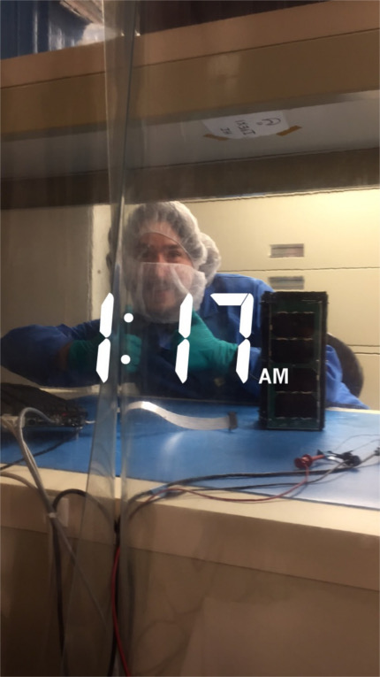
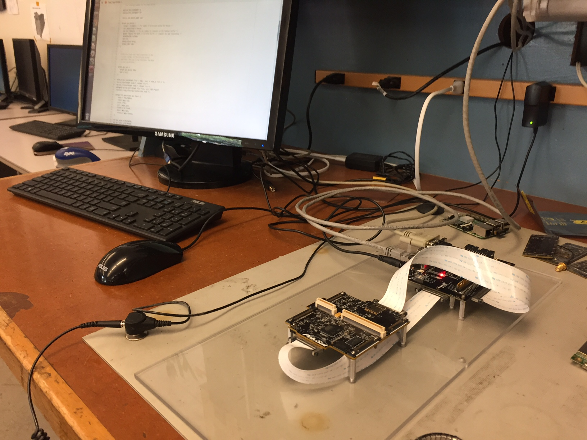
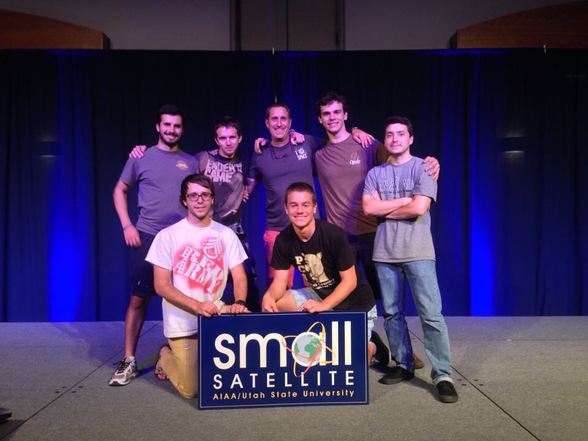
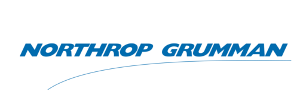
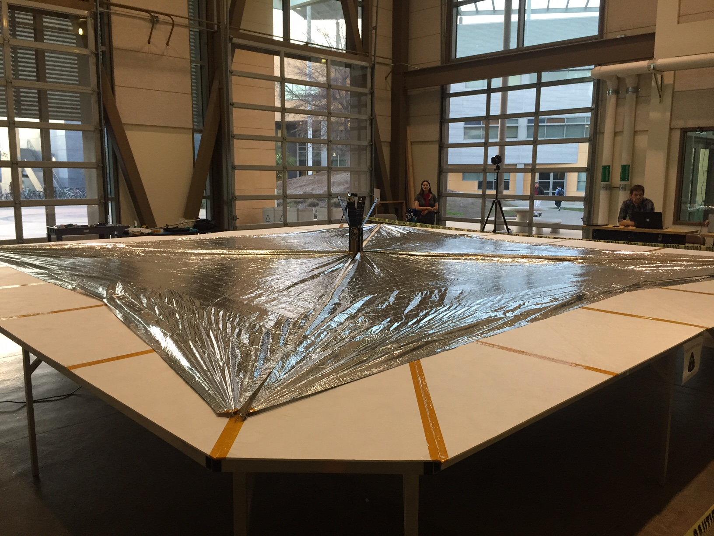

# Spacecraft Attitude Determination and Control

`youtube: nKMPYCKfi-g`

*
DAVE, a PolySat satellite measuring the damping properties of tungsten powder.
*

## Software Lead

I am currently the software team lead for this program. In my time in this position, I've learned that it can be quite challenging to manage a team of part-time programmers working on something as sophisticated as a satellite. This combined with the steadily increasing capability and complexity of the PolySat code base has led to several devops improvements. This includes upgrading our antiquated wiki and issue tracking system to [GitLab](https://about.gitlab.com/)--a much more modern software development tool. In addition, I've worked to add tests to software that previously had none. This motivated the addition of CI to our GitLab workflow, creating a much more robust development experience.

Another part of my responsibility as software lead is interfacing with the companies we work with. Generally, this involves meeting with the engineers to figure out software requirements and ICD's.

## Projects

I've worked on a variety of things in my time at PolySat, ranging from long-term programming projects to late-night debugging sessions in the cleanroom.

Here is a list of satellites that I've directly contributed to:

- <i>Ionsopheric Scintillation Explorer</i> (ISX). Collaboration with SRI International.
- <i>Exocube 2</i>. Collaboration with NASA Goddard.
- <i>Dampening and Vibrations Experiment</i> (DAVE). Collaboration with Northrop Grumman.
- <i>Launch Environment Observer</i> (LEO). Collaboration with NASA.
- <i>LightSail 2</i>. Collaboration with Planetary Society.

 

*
Debugging LEO late into the night. I took this photo from the cleanroom computer. Nik (pictured) was operating the hardware while I worked on the software.
*

In addition to doing general software support for each mission, I've also completed several long-term projects. Descriptions of those projects follows.

### Fault Tolerant Memory

Due to the harsh radiation environment of low earth orbit, and the price of radiation hardened components, all of PolySat's radiation fault tolerance is implemented in the software.

Recently, the System Board (the PolySat flight computer) needed a redesign due to the obsolescence of some components. This meant a new flash-based memory architecture, and further, a new fault tolerant memory system implemented in software.

*
Development setup for the System Board. The System Board is in the bottom right--a single board computer that sits at top of each PolySat satellite.
*

Since flash memory is susceptible to single event effects, I implemented a program in C that regularly computes a hash of all our critical software (the bootloader, Linux kernel, and core filesystem) and compares it to a hash that was computed on the ground. If the hash does not match, it is replaced by a valid copy stored somewhere else in memory.

To protect against flash chip failure, we have multiple flash chips that maintain multiple copies of the critical software. These chips are separate from main memory on serial interfaces to leave adequate room in main memory for less critical data.

This project also required significant modifications to the PolySat bootloader, which checks all kernel and file system images  for hash validity before loading them into RAM. The new memory architecture required adding robustness to the bootloader so the system could boot from several chips.

### PPS Linux Kernel Module

This was my introduction to Linux kernel programming, and it was a really fun learning experience.

In 2016, we added a GPS to our system, and we wanted to advantage of the GPS's timing accuracy to synchronize our clock. This was done by tying the GPS's pulse-per-second (PPS) line to one of our interrupts.

I wrote a Linux kernel module that recorded the system time whenever an interrupt occurred. The recorded time was then made available to userspace via the read system call, and a program in userspace adjusted the system time accordingly. To learn how to do this, I read through the book [Linux Device Drivers](http://shop.oreilly.com/product/9780596005900.do) and utilized a PolySat faculty advisor.

*
One of the benefits of being in PolySat--going to the SmallSat conference in Logan, Utah
*

### Northrop Satellite Lead

I am currently the project lead for a 3U satellite PolySat is doing with Northrop Grumman. This entails leading a team of aerospace, electrical, mechanical, and software engineers to design a spacecraft. In addition, I regularly communicate with Northrop employees to manage funding, evaluate requirements, and make design decisions. This satellite is still in the design phase; however, it has an aggressive schedule, hopefully launching sometime in 2018.

In order to procure funding for the satellite, our team was required to present at a system requirements review (SRR) at the Northrop Grumman facility in El Segundo, California. After several weeks of preparation, I presented the satellite's command and data handling subsystem to a team of reviewers.

In addition to being a great introduction to system engineering, the month of SRR preparation matured my ability to collaborate with a multidisciplinary team of engineers.

### GPS Driver

This was my first project for PolySat when I joined as a freshman. It consisted of writing a userspace driver in C for a GPS. I was also invloved in testing and debugging the hardware once the electrical engineers had finished design and fabrication of the board.

Once the software and hardware were working properly, I worked with Aerospace Corp to test the module in their GPS simulator. This was important because our module was a COTS GPS with its CoCom limits disabled, so we had little information on its orbital performance.

*
A picture from a [LightSail](http://www.planetary.org/explore/projects/lightsail-solar-sailing/) deployment test. We've been working with the Planetary Society on the satellite since the beginning.
*