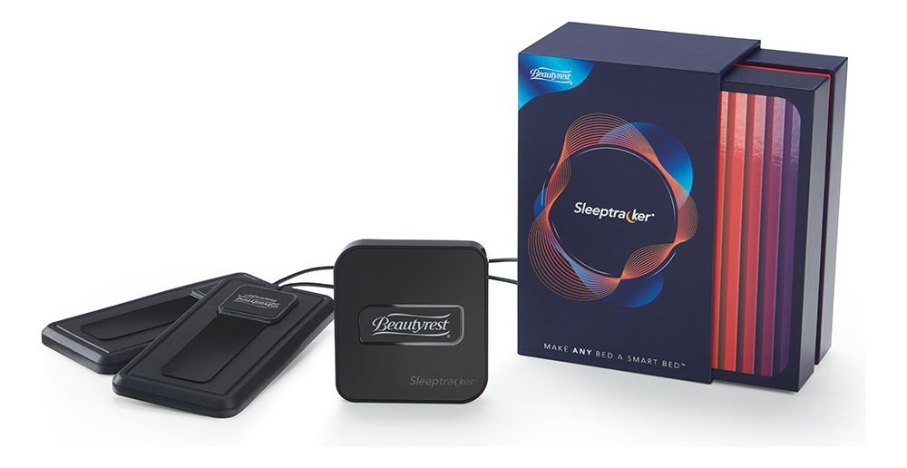

# Fullpower Firmware Internship

Source: Fullpower Technologies

Over the summer of 2018, I worked as a firmware intern at [Fullpower Technologies](https://www.fullpower.com/) in Santa Cruz, CA. I was tasked with improving the bootloader of the product depicted below, the Sleeptracker Monitor, which monitors the heart and breathing rate of a user while they sleep and makes the data available through a mobile app. The product runs embedded Linux and boots using [U-Boot](https://www.denx.de/wiki/U-Boot).

Source: Fullpower Technologies

Prior to my internship, the Sleeptracker Monitor used an old version of U-Boot provided by the chip manufacturer that lacked flexibility and fault tolerance. Over the summer, I brought the product up to the most recent version of U-Boot and also implemented several features that decreased boot time and improved the product's failure recovery capability. My bootloader is now running on thousands of devices with no issue, and I've only received one email asking for help! :)

These are the primary features I implemented:
- Boot into a failsafe OS if main OS is not booting successfully.
- Allow reflashing both failsafe OS and main OS from the U-Boot command line using TFTP.
- Reduce reflash time by optimizing SPI flash driver.

This project was incredibly rewarding, as it made a significant impact in the company. However, it did not come without its challenges. The MediaTek chipset (MT7688) was cheap and poorly documented, the source code for the old bootloader was hacked up and poorly written, and I did not have a practical debugging environment. Thus, there were many slow, painful days of debugging that produced little progress. However, by the end of the summer I had a working bootloader with all requested features that I was proud of.