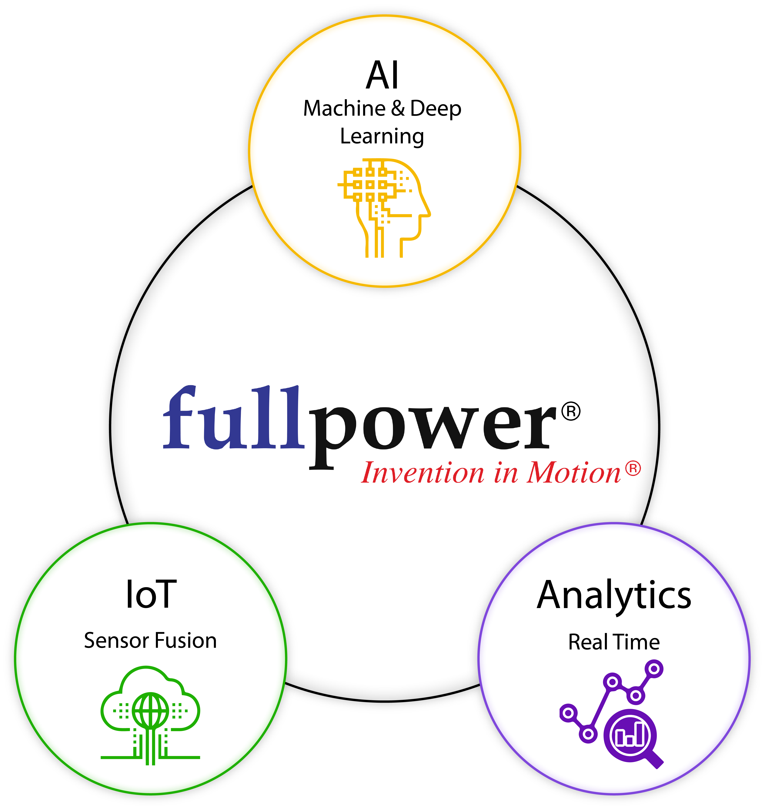

# Fullpower Summer Internship

As a junior and senior in high school, I had the opportunity to be a summer intern at [Fullpower Technologies](https://www.fullpower.com/). Fullpower is a technology company that develops fitness and health products under the MotionX and Sleeptracker brands.

During my first summer there, I worked on app testing and a web development project. As a junior in high school, I was given fairly little responsibility, but I learned a lot regardless.

The following summer, I worked on developing a new product--a bed that recorded heart and breathing rate while a user slept. Since the timeline for that product was short, the engineers knew me from the previous summer, and stress was high at the company, I was given more responsibility.

I wrote several data collection and test automation scripts in Python to expedite prototype development. I also wrote a program that started a web server on a BeagleBone Black and served diagnostic information. This made it easy for engineers to determine the state of a prototype by typing its IP address into a web browser.

Although I did gain great programming experience at Fullpower, I was also able to get a much better understanding of industry. Having this before college became incredibly valuable for projects like PolySat and Jupyter.
