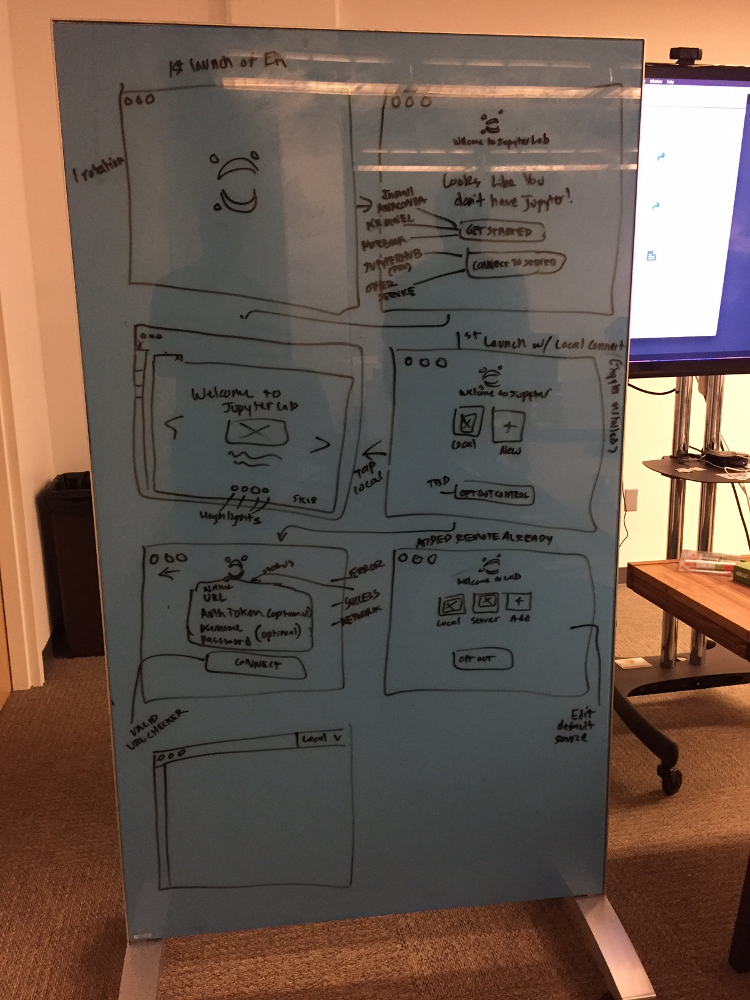

# Project Jupyter

From Spring 2017 to Fall 2017, I worked as an intern with [Project Jupyter](https://jupyter.org/), an open source platform for interactive computing. Project Jupyter's most popular project is the Jupyter Notebook, which is pictured below. It runs in the browser, and it is intended primarily for students, data scientists, scientists, and engineers.

*
The Jupyter Notebook
*

This project gave me a lot of experience with web development. Specifically, I learned about the depths of Typescript, React, HTML, CSS, Webpack and Electron.

## JupyterLab Native

JupyterLab Native was my primary project over the summer of 2017. Project Jupyter is currently developing their next generation environment, [JupyterLab](https://github.com/jupyterlab/jupyterlab). I worked on developing the native version of this app using [electron](https://electron.atom.io/). You can find the github page for the project [here](https://github.com/jupyterlab/jupyterlab_app). 

*
The JupyterLab Native Logo
*

The native version of JupyterLab takes advantage of native API's to augment to JupyterLab experience. There were several challenges to overcome in this project. JupyterLab's webpack build was very complex and difficult to port. Furthermore, mapping JupyterLab's API's to native API's was often nontrivial.

*
Working with designers on JupyterLab Native
*

I also worked closely with the Jupyter designers to improve the JupyterLab Native experience. Above is a picture from one of many design brainstorms.