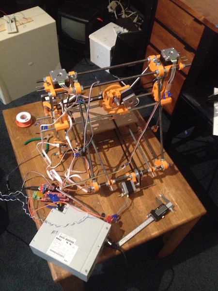

# Personal Projects

## High School

When I was in high school, I enjoyed doing hobbyist electronics projects. My favorite platforms were Arduino, Raspberry Pi, and BeagleBone Black. I still enjoy doing these types of projects; however, I find myself working more on satellites now. You can find a video of some of the robots I built [here.](https://www.youtube.com/watch?v=I1k-_aE0UxU)

Another one of my favorite projects was using a Raspberry Pi to allow remotely closing the garage door through a simple web interface. I also built a 3D printer as a high school senior project:

