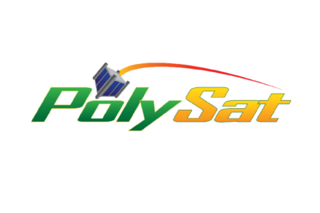

 

 

[PolySat](http://polysat.calpoly.edu) is Cal Poly's CubeSat program. If you don't know about CubeSats, take a look at [this.](https://en.wikipedia.org/wiki/CubeSat)

 

I am currently the software team lead for this program. PolySat's flight software is designed to be as fault tolerant, reusable, and modular as possible. This is important for several reasons. First, raditation hardened electrical components are beyond our price range, so we are required to use [COTS](https://en.wikipedia.org/wiki/Commercial_off-the-shelf) parts. This means our avionics are susceptible to single event effects, and these effects must be handled gracefully in software. Furthermore, since PolySat is run by college students, we suffer from very high turnover rates as members regularly graduate. This is why reusability and modularity are key, as once the architect of a program graduates, we need to continue developing wihtout stoping to understand their code. To achieve modularity, PolySat flight software uses Linux. Code is organized into individual Linux processes based on functionality, and everything communicates through the Linux Sockets API. To manage collaboration, we use Git.

 

I spent the Summer of 2016 working full-time at PolySat. In that time, I developed a lot as a programmer and completed several mission critical projects. 

 

Through this program, I've contributed to five CubeSats that are manifested and scheduled to launch next year. These are listed below:

- <i>Ionsopheric Scintillation Explorer</i> (ISX). Collaboration with Stanford Research Institute.
- <i>Exocube 2</i>. Collaboration with NASA Goddard.
- <i>Dampening and Vibrations Experiment</i> (DAVE). Collaboration with Northrop Grumman.
- <i>Launch Environment Observer</i> (LEO). Collaboration with NASA.
- <i>LightSail 2</i>. Collaboration with Planetary Society.